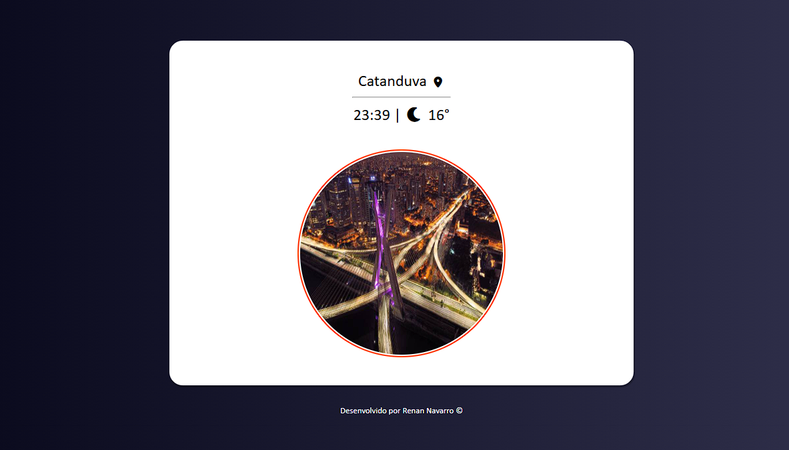

Site para uma Usina


# ⚡ Projeto Usina

Uma landing page moderna e responsiva desenvolvida com foco em visual impactante, organização de conteúdo e experiência do usuário.

## 🚀 Sobre o projeto

O **Projeto Usina** foi criado com o objetivo de praticar conceitos modernos de desenvolvimento front-end, incluindo:

* Estruturação semântica com HTML5
* Estilização avançada com CSS3
* Responsividade para diferentes dispositivos
* Organização visual inspirada em landing pages profissionais
* Efeitos visuais e experiência interativa

## 🛠️ Tecnologias utilizadas

* HTML5
* CSS3
* JavaScript
* Git & GitHub

## 📱 Responsividade

O projeto foi desenvolvido com foco em adaptação para:

* Desktop
* Tablets
* Smartphones

## 🎯 Objetivos do projeto

* Melhorar habilidades em front-end
* Praticar responsividade
* Aprender mais sobre estrutura visual moderna
* Evoluir na criação de interfaces web

## 🌐 Deploy

Acesse o projeto online:

👉 https://renannavarro016.github.io/projeto-usina/

## 📸 Preview



## 📂 Como executar o projeto

```bash
# Clone o repositório
git clone https://github.com/seuusuario/projeto-usina.git

# Abra o index.html
```

## 👨‍💻 Desenvolvedor

Desenvolvido por Renan Navarro.

## 📌 Status

✅ Projeto finalizado
